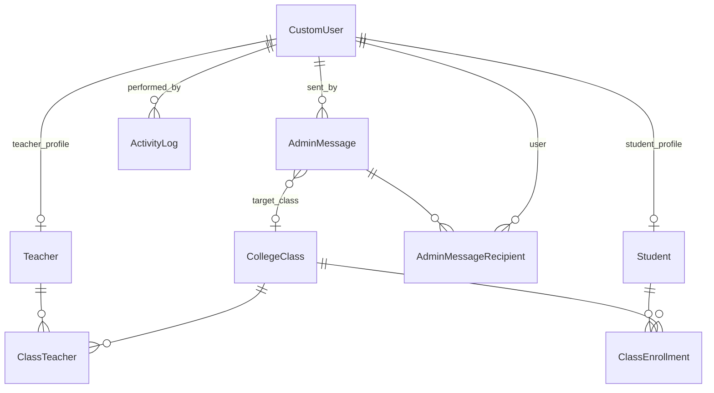

# Goodwill Christian College — College Management System

A Django 6.0 web portal for **Goodwill Christian College For Women** (GCCW), affiliated to Bengaluru North University. The system centralizes academic operations — user management, class organization, messaging, and (planned) attendance, assignments, fees, and announcements — behind a single role-based web interface.

---

## Table of Contents

1. [Tech Stack](#tech-stack)
2. [Quick Start](#quick-start)
3. [Implementation Status](#implementation-status)
4. [User Roles](#user-roles)
5. [Architecture](#architecture)
6. [Authentication & Access Control](#authentication--access-control)
7. [Data Models](#data-models)
8. [Admin Dashboard](#admin-dashboard)
9. [Student Portal](#student-portal)
10. [Teacher Portal](#teacher-portal)
11. [Frontend](#frontend)
12. [Planned Apps](#planned-apps)
13. [Security Notes](#security-notes)
14. [Recommended Next Steps](#recommended-next-steps)

---

## Tech Stack

| Layer | Technology |
|-------|------------|
| Framework | Django 6.0.5 |
| Database | MySQL (`college_management`) |
| Auth | Custom user model (`accounts.CustomUser`) |
| Templates | Django Templates + Bootstrap Icons |
| Email | Console backend (development) |

**Dependencies:** Django 6.0.5 and a MySQL client (e.g. `mysqlclient`). Install with:

```bash
pip install django==6.0.5 mysqlclient
```

---

## Quick Start

### Prerequisites

- Python 3.10+
- MySQL server running on `localhost:3306`

### Setup

```bash
# 1. Create the MySQL database
mysql -u root -p -e "CREATE DATABASE college_management CHARACTER SET utf8mb4;"

# 2. Run migrations
python manage.py migrate

# 3. Create demo users (also auto-created on migrate when AUTO_CREATE_DEMO_USERS=True)
python manage.py create_demo_users

# 4. Start the development server
python manage.py runserver
```

Visit **http://127.0.0.1:8000/**

### Demo Credentials (DEBUG mode)

| Role | Username | Password | Redirect after login |
|------|----------|----------|----------------------|
| Admin | `admin` | `admin123` | `/admin-dashboard/` |
| Lecturer | `lecturer` | `lecturer123` | `/lecturer-dashboard/` |
| Student | `student` | `student123` | `/student-dashboard/` |

Demo users are auto-created on `migrate` and on first login page load when `AUTO_CREATE_DEMO_USERS = True`.

---

## Implementation Status

The codebase is in an **early-to-mid development** phase. Core infrastructure and the **admin experience are production-ready in structure**, while student/teacher portals are **visual prototypes** and several Django apps exist only as placeholders.

| Area | Status |
|------|--------|
| Landing page | ✅ Implemented |
| Role-based login | ✅ Implemented |
| Admin dashboard (custom UI) | ✅ Fully implemented |
| User & class management | ✅ Fully implemented |
| Admin messaging (email) | ✅ Fully implemented |
| Activity logging | ✅ Implemented |
| Django admin integration | ✅ Implemented |
| Student dashboard | ⚠️ UI shell with static/demo data |
| Teacher dashboard | ⚠️ UI shell with static/demo data |
| Attendance | ❌ App scaffolded, no models/views |
| Assignments | ❌ App scaffolded, no models/views |
| Announcements | ❌ App scaffolded, no models/views |
| Fees | ❌ App scaffolded, no models/views |
| Automated tests | ❌ Empty placeholders |

### Key Design Decisions

1. **Single source of truth for profiles** — `Student` and `Teacher` profile models live in the `accounts` app, not in the `students`/`teachers` apps.
2. **Custom admin UI** — Day-to-day admin work uses a branded dashboard (`admin_views.py`), while Django's built-in admin (`/admin/`) is available for superuser data access.
3. **Email via Django mail** — Welcome emails and admin messages use `django.core.mail.send_mail` with a console backend in development.
4. **MySQL** — Production-oriented database choice configured in `config/settings.py`.

---

## User Roles

| Role | DB value | Login tab | Redirect after login |
|------|----------|-----------|----------------------|
| Admin | `admin` | Admin | `/admin-dashboard/` |
| Lecturer | `teacher` | Lecturers | `/lecturer-dashboard/` |
| Student | `student` | Students | `/student-dashboard/` |

---

## Architecture

### Directory Structure

```
college-management/
├── config/                 # Django project settings and root URLs
│   ├── settings.py
│   ├── urls.py
│   ├── context_processors.py
│   ├── wsgi.py
│   └── asgi.py
├── accounts/               # Core app: users, classes, admin dashboard, auth
│   ├── models.py
│   ├── views.py            # Login, student/teacher dashboards
│   ├── admin_views.py      # Custom admin dashboard views
│   ├── admin_urls.py
│   ├── urls.py
│   ├── forms.py
│   ├── decorators.py
│   ├── demo_users.py
│   ├── services/
│   │   ├── user_service.py
│   │   └── email_service.py
│   └── management/commands/create_demo_users.py
├── students/               # URL alias for student dashboard (no models)
├── teachers/               # URL alias for teacher dashboard (no models)
├── attendance/             # Placeholder app
├── assignments/            # Placeholder app
├── announcements/          # Placeholder app
├── fees/                   # Placeholder app
├── templates/              # Shared and role-specific HTML templates
├── static/                 # CSS, JS, images
├── docs/                   # Split documentation (superseded by this file)
└── manage.py
```

### Installed Apps

```python
INSTALLED_APPS = [
    'django.contrib.admin',
    'django.contrib.auth',
    'django.contrib.contenttypes',
    'django.contrib.sessions',
    'django.contrib.messages',
    'django.contrib.staticfiles',
    'accounts',
    'students',
    'teachers',
    'attendance',
    'assignments',
    'announcements',
    'fees',
]
```

### Settings Highlights

| Setting | Value | Purpose |
|---------|-------|---------|
| `AUTH_USER_MODEL` | `accounts.CustomUser` | Custom user with role field |
| `LOGIN_URL` | `/accounts/login/` | Unauthenticated redirect |
| `LOGIN_REDIRECT_URL` | `/student-dashboard/` | Default post-login (overridden per role) |
| `AUTO_CREATE_DEMO_USERS` | `True` | Provision demo accounts on migrate/login |
| `DATABASES` | MySQL `college_management` | Local MySQL on port 3306 |
| `STATICFILES_DIRS` | `static/` | Project-level static assets |
| `MEDIA_ROOT` | `media/` | User uploads (configured, not yet used) |
| `EMAIL_BACKEND` | Console backend | Prints emails to terminal in dev |

### Database

| Setting | Value |
|---------|-------|
| Engine | `django.db.backends.mysql` |
| Name | `college_management` |
| User / Password | `root` / `root` (development defaults) |
| Host | `localhost:3306` |

All migrations currently exist only under `accounts/migrations/` (4 migration files).

### URL Routing

| URL | Handler | Name |
|-----|---------|------|
| `/` | Landing page (`index.html`) | `home` |
| `/admin/` | Django admin site | — |
| `/accounts/login/` | Role-based login | `login` |
| `/accounts/logout/` | Logout | `logout` |
| `/admin-dashboard/` | Custom admin dashboard (included) | `admin_dashboard` |
| `/student-dashboard/` | Student dashboard | `student_dashboard` |
| `/lecturer-dashboard/` | Teacher dashboard | `lecturer_dashboard` |
| `/teacher-dashboard/` | Teacher dashboard (alias) | `teacher_dashboard` |
| `/student/dashboard/` | Student dashboard (alias) | `student_dashboard` |
| `/teacher/dashboard/` | Teacher dashboard (alias) | `teacher_dashboard` |

#### Admin Dashboard Sub-Routes

| Nav item | URL name | Path |
|----------|----------|------|
| Dashboard | `admin_dashboard` | `/admin-dashboard/` |
| User Management | `admin_users` | `/admin-dashboard/users/` |
| Create User | `admin_user_create` | `/admin-dashboard/users/create/` |
| Toggle User | `admin_user_toggle` | `/admin-dashboard/users/<id>/toggle/` |
| Bulk Actions | `admin_users_bulk` | `/admin-dashboard/users/bulk/` |
| Classes | `admin_classes` | `/admin-dashboard/classes/` |
| Create Class | `admin_class_create` | `/admin-dashboard/classes/create/` |
| Class Detail | `admin_class_detail` | `/admin-dashboard/classes/<id>/` |
| Assign Teachers | `admin_class_assign_teachers` | `/admin-dashboard/classes/<id>/assign-teachers/` |
| Enroll Students | `admin_class_enroll_students` | `/admin-dashboard/classes/<id>/enroll-students/` |
| Compose Message | `admin_messages_compose` | `/admin-dashboard/messages/` |
| Message History | `admin_messages_history` | `/admin-dashboard/messages/history/` |

### Template Inheritance

```
base.html                    # Landing page layout
login_base.html              # Login page layout
dashboard_base.html          # Student dashboard shell
teacher_base.html            # Teacher dashboard shell
admin_base.html              # Admin dashboard shell
```

Context processor `config.context_processors.college_context` injects `admission_year` (`2026-2027`) into all templates.

### App Startup Hook

`accounts.apps.AccountsConfig.ready()` connects a `post_migrate` signal that calls `ensure_demo_users_on_migrate`, creating demo users after every `migrate` when `AUTO_CREATE_DEMO_USERS` is enabled.

---

## Authentication & Access Control

### Login Flow

Entry point: `accounts.views.user_login` at `/accounts/login/`

The login page presents three tabs (Admin, Lecturers, Students). The active tab is determined by:

- `?role=admin|lecturer|student` query parameter (GET)
- `login_role` hidden form field (POST)

**Validation steps on POST:**

1. Username and password are non-empty
2. `authenticate()` succeeds
3. User `is_active` is `True`
4. User's database `role` matches the selected tab's expected role

If any check fails, the login form re-renders with an error. Role mismatch shows a generic "Invalid credentials" message.

**Post-login redirect** (`LOGIN_ROLE_MAP` in `accounts/views.py`):

| Tab | DB role | Redirect path |
|-----|---------|---------------|
| `admin` | `admin` | `/admin-dashboard/` |
| `lecturer` | `teacher` | `/lecturer-dashboard/` |
| `student` | `student` | `/student-dashboard/` |

The selected tab is stored in `request.session['login_role']`.

### Access Decorators

| Decorator | Behavior |
|-----------|----------|
| `@login_required` | Student and teacher dashboards require authentication |
| `@admin_required` | Custom decorator in `accounts/decorators.py` — redirects unauthenticated or non-admin users to login |

All views in `accounts/admin_views.py` use both `@login_required` and `@admin_required`.

### Demo User Provisioning

Defined in `accounts/demo_users.py`:

| Username | Password | Role | Email | Staff | Superuser |
|----------|----------|------|-------|-------|-----------|
| `admin` | `admin123` | admin | admin@goodwillcollege.edu | Yes | Yes |
| `lecturer` | `lecturer123` | teacher | lecturer@goodwillcollege.edu | Yes | No |
| `student` | `student123` | student | student@goodwillcollege.edu | No | No |

**Trigger points:**

1. Post-migrate signal — `AccountsConfig.ready()` → `ensure_demo_users_on_migrate`
2. Login page load — `ensure_demo_users_if_needed()` (lazy, once per process)
3. Management command — `python manage.py create_demo_users`

When `DEBUG = True`, demo credentials are shown on the login page for developer convenience.

### User Account Creation (Admin)

Admins create accounts via the admin dashboard (no self-registration). New accounts receive:

- Auto-generated username (slugified from name, with numeric suffix on collision)
- Random temporary password (`secrets.token_urlsafe(8)`)
- Welcome email with credentials

---

## Data Models

The `accounts` app owns all core data models.

### CustomUser

Extends Django's `AbstractUser` with a `role` field (`admin`, `teacher`, `student`).

- `display_name` property — full name if set, otherwise username

### Student

One-to-one with `CustomUser` (`related_name='student_profile'`).

| Field | Type | Notes |
|-------|------|-------|
| `user` | OneToOne → CustomUser | Required |
| `course` | CharField(100) | e.g. "BCA (AI & ML)" |
| `semester` | CharField(20) | e.g. "Sem II" |

### Teacher

One-to-one with `CustomUser` (`related_name='teacher_profile'`).

| Field | Type | Notes |
|-------|------|-------|
| `user` | OneToOne → CustomUser | Required |
| `department` | CharField(100) | e.g. "BCA" |
| `subject` | CharField(100) | e.g. "Computer Science" |

### CollegeClass

Represents an academic class/section.

| Field | Type | Notes |
|-------|------|-------|
| `name` | CharField(100) | e.g. "BCA-A" |
| `grade` | CharField(50) | e.g. "BCA" |
| `section` | CharField(20) | e.g. "A" |
| `subject` | CharField(100) | e.g. "Database Systems" |
| `teachers` | M2M → Teacher | Through `ClassTeacher` |
| `students` | M2M → Student | Through `ClassEnrollment` |
| `created_at` / `updated_at` | DateTimeField | Auto timestamps |

Properties: `student_count`, `teacher_count`.

### AdminMessage & AdminMessageRecipient

Records messages sent by admins, with per-recipient tracking.

**Target types:**

| Constant | Label |
|----------|-------|
| `individual` | Individual |
| `role_teachers` | All Teachers |
| `role_students` | All Students |
| `role_all` | All Users |
| `class` | By Class |
| `custom` | Custom Selection |

### ActivityLog

Audit trail for admin actions: user created/activated/deactivated, class created, teacher assigned, student enrolled, message sent.

### Entity Relationship Diagram



### Forms (`accounts/forms.py`)

| Form | Purpose |
|------|---------|
| `CreateUserForm` | Admin user creation (teacher/student) |
| `CollegeClassForm` | ModelForm for class creation |
| `ComposeMessageForm` | Admin message composition with dynamic recipient fields |
| `UserFilterForm` | Search/filter on user list (q, role, status) |

### Services

**User Service** (`accounts/services/user_service.py`):

- `create_user_account(...)` — Creates user atomically with profile, activity log, and welcome email
- `log_user_status_change(user, is_active, performed_by)` — Logs activation/deactivation

**Email Service** (`accounts/services/email_service.py`):

- `send_welcome_email(user, temporary_password)` — New account credentials
- `send_admin_message_email(recipient_email, subject, body, sender_name)` — Admin broadcast messages

Both use `django.core.mail.send_mail` with `DEFAULT_FROM_EMAIL` (`noreply@goodwillcollege.edu`).

---

## Admin Dashboard

The custom admin dashboard lives at `/admin-dashboard/` in `accounts/admin_views.py` with templates under `templates/admin/`.

### Dashboard Overview

Displays stats cards (teacher/student/class counts, active/inactive accounts), quick actions, recent activity (last 10 `ActivityLog` entries), class stats, and recent messages.

### User Management

- **List** — Filter by search, role, and status; paginated (15 per page); prefetches profiles
- **Create** — Via `CreateUserForm` and `create_user_account()` service
- **Toggle status** — POST to flip `is_active` for a single user
- **Bulk actions** — POST to activate/deactivate selected users

### Class Management

- **List** — All classes with enrollment and teacher counts
- **Create** — Name, grade, section, subject
- **Detail** — Assigned teachers, enrolled students, available users for assignment
- **Assign/remove teachers** — Via `ClassTeacher` join table
- **Enroll/remove students** — Via `ClassEnrollment` join table
- **Reassign teacher** — Move teacher to another class

### Messaging

**Compose flow:**

1. Admin fills `ComposeMessageForm` (subject, body, target type, recipients)
2. `_resolve_message_recipients()` builds recipient list
3. Filters to users with valid email addresses
4. Creates `AdminMessage` and `AdminMessageRecipient` records
5. Sends email to each recipient
6. Logs `ACTION_MESSAGE_SENT`

**Recipient resolution:**

| Target type | Recipients |
|-------------|------------|
| Individual | Selected user |
| All Teachers | Active users with `role='teacher'` |
| All Students | Active users with `role='student'` |
| All Users | Active teachers + students |
| By Class | Active teachers and students in the class |
| Custom | Selected users from multiselect |

**Message history** — Paginated list (20 per page) of all sent messages.

---

## Student Portal

### Entry Points

| URL | View |
|-----|------|
| `/student-dashboard/` | `accounts.views.student_dashboard` |
| `/student/dashboard/` | Re-export via `students.views` |

### Current State

Requires login and `role == 'student'`. Renders `templates/student_dashboard.html` with **hardcoded context** — it does not query the `Student` profile or database:

- Registration number, semester, course, section are static strings
- Metrics (announcements, attendance, assessment, tasks, placement) are hardcoded

> **Gap:** The view does not use `request.user.student_profile` or `ClassEnrollment` for real data.

### Sidebar Navigation

Dashboard is active; all other items (Profile, Syllabus, Calendar, Time Table, Attendance, Assessment, Assignments, Fees, Announcements, Placement, Hostel, Library, Leave, Messages, Settings) are placeholders (`href="#"`).

### Styling

- `static/css/student-dashboard.css`
- `static/css/theme.css`
- Bootstrap Icons

---

## Teacher Portal

### Entry Points

| URL | View |
|-----|------|
| `/lecturer-dashboard/` | `accounts.views.teacher_dashboard` (primary) |
| `/teacher-dashboard/` | Alias |
| `/teacher/dashboard/` | Re-export via `teachers.views` |

### Current State

Requires login and `role == 'teacher'`. Renders `templates/teacher_dashboard.html` with **static placeholder data**:

- Stats (classes: 6, students: 148, attendance: 87%, assignments: 12, notes: 24) are hardcoded
- Today's schedule, recent activity, and upcoming deadlines are static

> **Gap:** Stats do not reflect actual `CollegeClass` assignments or enrollment counts.

### Sidebar Navigation

Dashboard is active; My Classes, Attendance, Notes, Assignments, Students, Calendar, Messages, Reports, and Settings are placeholders.

### Styling

- `static/css/teacher-dashboard.css`
- `static/css/theme.css`
- Reuses teacher-style stat cards also used by admin dashboard

---

## Frontend

### Templates

| Category | Key files |
|----------|-----------|
| Public | `index.html`, `login.html` |
| Dashboard shells | `dashboard_base.html`, `teacher_base.html`, `admin_base.html` |
| Admin | `admin/dashboard.html`, `users.html`, `user_form.html`, `classes.html`, `class_form.html`, `class_detail.html`, `messages_compose.html`, `messages_history.html` |
| Role dashboards | `student_dashboard.html`, `teacher_dashboard.html` |

### Static Assets

| File | Purpose |
|------|---------|
| `static/css/theme.css` | Global design tokens, shared components |
| `static/css/login-portal.css` | Login page styling |
| `static/css/student-dashboard.css` | Student ERP sidebar and dashboard |
| `static/css/teacher-dashboard.css` | Teacher/admin shared dashboard components |
| `static/css/admin-dashboard.css` | Admin-specific overrides |
| `static/js/landing.js` | Landing page interactions |
| `static/js/login-portal.js` | Login form enhancements |
| `static/js/admin-dashboard.js` | Admin UI (message target toggling, bulk selection) |
| `static/img/goodwill-logo.svg` | College logo |
| `static/img/default-avatar.svg` | Default profile photo |

### Landing Page Sections

1. **Hero** — College name, tagline, login CTA
2. **Features grid** — Six portal feature cards
3. **Courses** — BCA, B.Com, BBA program cards
4. **About** — College description
5. **Contact** — Address and contact info
6. **Footer** — Copyright and links

### Design System

- **Icons:** Bootstrap Icons (`bi bi-*`) via CDN
- **Stat card colors:** blue, purple, green, orange, pink variants
- **Layout:** Sidebar + main content for all dashboards; responsive with sidebar toggle
- **Admin forms:** `adm-input`, `adm-textarea`, `adm-multiselect`, `adm-search` CSS classes

`MEDIA_URL` and `MEDIA_ROOT` are configured but no views handle file uploads yet. Profile photos use a static default avatar.

---

## Planned Apps

Four Django apps are registered but contain **no models, views, URLs, or admin registrations**:

| App | Planned purpose | Referenced in UI |
|-----|-----------------|------------------|
| `attendance` | Track attendance per class/session | Student & teacher sidebars, dashboards |
| `assignments` | Faculty creates assignments; students submit | Student & teacher sidebars, dashboards |
| `announcements` | Campus-wide and class-specific bulletin | Student sidebar, dashboard metrics |
| `fees` | Fee structure, payment tracking, receipts | Student sidebar, landing page |

The `students` and `teachers` apps are **URL namespace aliases** only — all profile and class data lives in `accounts`.

**Note:** Admin messaging (`AdminMessage`) exists for **email broadcasts**, but there is no in-portal announcement feed for students/teachers.

### Likely Future Models (not implemented)

**Attendance:** Session (class, date, period) + Record (student, status)

**Assignments:** Assignment (class, title, due date) + Submission (student, file, grade)

**Announcements:** Announcement (title, body, author, audience, published at)

**Fees:** Fee structure (course, amount, due date) + Payment record (student, amount, receipt)

---

## Security Notes

Current settings are **not production-ready**:

- `DEBUG = True`
- Hardcoded `SECRET_KEY` in settings
- `ALLOWED_HOSTS = []`
- Database credentials in plain text
- Console email backend

Externalize these via environment variables before deployment.

---

## Recommended Next Steps

Based on UI prominence and existing admin infrastructure:

1. **Wire student/teacher dashboards to real data** — Use existing `Student`, `Teacher`, `CollegeClass` models
2. **announcements** — In-portal feed complements existing admin email messaging
3. **attendance** — High visibility in both portals
4. **assignments** — Depends on class enrollment (already implemented)
5. **fees** — Independent module, can be added last
6. **Add automated tests** — All `tests.py` files are currently empty
7. **Populate `requirements.txt`** — Pin Django and MySQL client versions
