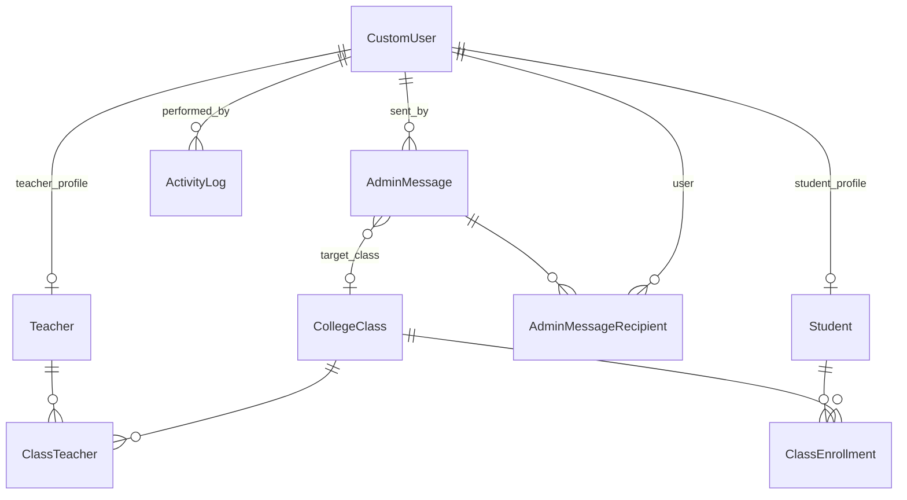

# Accounts App

The `accounts` app is the **core of the project**. It owns authentication, user profiles, class management, admin messaging, activity logging, and the student/teacher dashboard views.

## Models

### CustomUser

Extends Django's `AbstractUser`. Adds a `role` field (`admin`, `teacher`, `student`).

### Student

One-to-one with `CustomUser` (`related_name='student_profile'`).

| Field | Type | Notes |
|-------|------|-------|
| `user` | OneToOne → CustomUser | Required |
| `course` | CharField(100) | e.g. "BCA (AI & ML)" |
| `semester` | CharField(20) | e.g. "Sem II" |

### Teacher

One-to-one with `CustomUser` (`related_name='teacher_profile'`).

| Field | Type | Notes |
|-------|------|-------|
| `user` | OneToOne → CustomUser | Required |
| `department` | CharField(100) | e.g. "BCA" |
| `subject` | CharField(100) | e.g. "Computer Science" |

### CollegeClass

Represents an academic class/section.

| Field | Type | Notes |
|-------|------|-------|
| `name` | CharField(100) | e.g. "BCA-A" |
| `grade` | CharField(50) | e.g. "BCA" |
| `section` | CharField(20) | e.g. "A" |
| `subject` | CharField(100) | e.g. "Database Systems" |
| `teachers` | M2M → Teacher | Through `ClassTeacher` |
| `students` | M2M → Student | Through `ClassEnrollment` |
| `created_at` | DateTimeField | auto_now_add |
| `updated_at` | DateTimeField | auto_now |

Properties: `student_count`, `teacher_count`.

### ClassTeacher

Join table for teacher-to-class assignments. Unique on `(college_class, teacher)`.

### ClassEnrollment

Join table for student-to-class enrollments. Unique on `(college_class, student)`.

### AdminMessage

Records messages sent by admins.

| Field | Type | Notes |
|-------|------|-------|
| `sent_by` | FK → CustomUser | Nullable (SET_NULL) |
| `subject` | CharField(255) | |
| `body` | TextField | |
| `target_type` | CharField | See target types below |
| `target_class` | FK → CollegeClass | Nullable, for class-targeted messages |
| `recipient_count` | PositiveIntegerField | |
| `sent_at` | DateTimeField | auto_now_add |

**Target types:**

| Constant | Label |
|----------|-------|
| `individual` | Individual |
| `role_teachers` | All Teachers |
| `role_students` | All Students |
| `role_all` | All Users |
| `class` | By Class |
| `custom` | Custom Selection |

### AdminMessageRecipient

Per-recipient record for sent messages.

| Field | Type |
|-------|------|
| `message` | FK → AdminMessage |
| `user` | FK → CustomUser |
| `email` | EmailField |

### ActivityLog

Audit trail for admin actions.

| Action constant | Description |
|-----------------|-------------|
| `user_created` | New account created |
| `user_activated` | Account activated |
| `user_deactivated` | Account deactivated |
| `class_created` | New class created |
| `teacher_assigned` | Teacher assigned to class |
| `student_enrolled` | Student enrolled in class |
| `message_sent` | Admin message sent |

## Forms

Defined in `accounts/forms.py`:

| Form | Purpose |
|------|---------|
| `CreateUserForm` | Admin user creation (teacher/student) |
| `CollegeClassForm` | ModelForm for class creation |
| `ComposeMessageForm` | Admin message composition with dynamic recipient fields |
| `UserFilterForm` | Search/filter on user list (q, role, status) |

### CreateUserForm Validation

- Teachers require `subject`
- Students require `course`
- `department`, `semester` are optional

### ComposeMessageForm Validation

Recipient fields are required based on `target_type`:

- `individual` → `individual_user`
- `class` → `target_class`
- `custom` → `custom_recipients` (at least one)

## Services

### User Service (`accounts/services/user_service.py`)

#### `create_user_account(...)`

Creates a user atomically:

1. Validates email uniqueness
2. Generates username via `_generate_username()` (slugified name, numeric suffix on collision)
3. Generates temp password via `_generate_temp_password()` (`secrets.token_urlsafe(8)`)
4. Creates `CustomUser` with `create_user()`
5. Creates `Teacher` or `Student` profile based on role
6. Logs `ACTION_USER_CREATED` to `ActivityLog`
7. Sends welcome email

Returns `(user, temp_password)`.

#### `log_user_status_change(user, is_active, performed_by)`

Logs activation/deactivation to `ActivityLog`.

### Email Service (`accounts/services/email_service.py`)

| Function | Purpose |
|----------|---------|
| `send_welcome_email(user, temporary_password)` | New account credentials |
| `send_admin_message_email(recipient_email, subject, body, sender_name)` | Admin broadcast messages |

Both use `django.core.mail.send_mail` with `DEFAULT_FROM_EMAIL` (`noreply@goodwillcollege.edu`).

## Django Admin

`accounts/admin.py` registers all models:

- `CustomUserAdmin` — extends `UserAdmin`, adds `role` to fieldsets and list display
- Basic registration for all other models

Accessible at `/admin/` for superusers.

## Migrations

| File | Description |
|------|-------------|
| `0001_initial.py` | `CustomUser` model |
| `0002_alter_customuser_role.py` | Role field adjustments |
| `0003_alter_customuser_role_student_teacher.py` | `Student`, `Teacher` models |
| `0004_alter_customuser_role_alter_student_course_and_more.py` | `CollegeClass`, enrollments, messages, activity log |

## Entity Relationship Diagram

